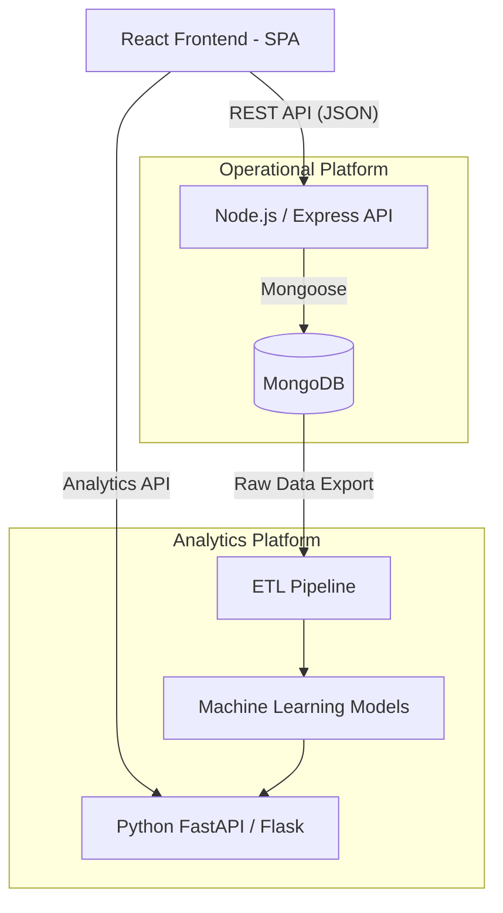
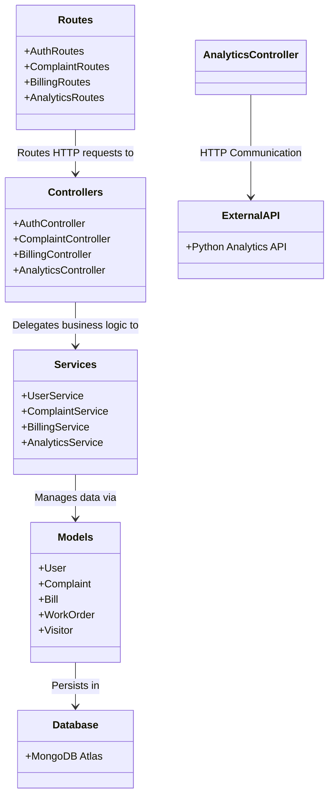
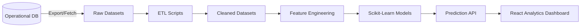

# System Architecture

SocietySphere utilizes a hybrid architecture combining a transactional MERN stack (MongoDB, Express, React, Node.js) with a dedicated Python Analytics service.

## 1. High-Level Architecture

## 2. Architectural Class Diagram (Backend MVC)

The Node.js Operational Platform strictly adheres to an MVC-based Service-oriented architecture.

## 3. Request Lifecycle

1. **Client Request**: The React frontend sends an HTTP request (e.g., `POST /api/complaints`).
2. **Security & Validation**: Request passes through Auth, Tenant isolation, and validation layers (Detailed in `Security.md`).
3. **Controller Layer**: Handles HTTP logic, extracts params, and formats the response.
4. **Service Layer**: Executes core business rules.
5. **Database**: Executes the query using Mongoose.
6. **Response**: Standardized JSON response returned to the client.

## 4. Analytics & Machine Learning Pipeline

The Python Analytics service operates asynchronously from the transactional Node.js API to ensure heavy computations do not block operational workflows.

*Note: For detailed security policies, RBAC, and data isolation strategies, please see `Security.md`.*
