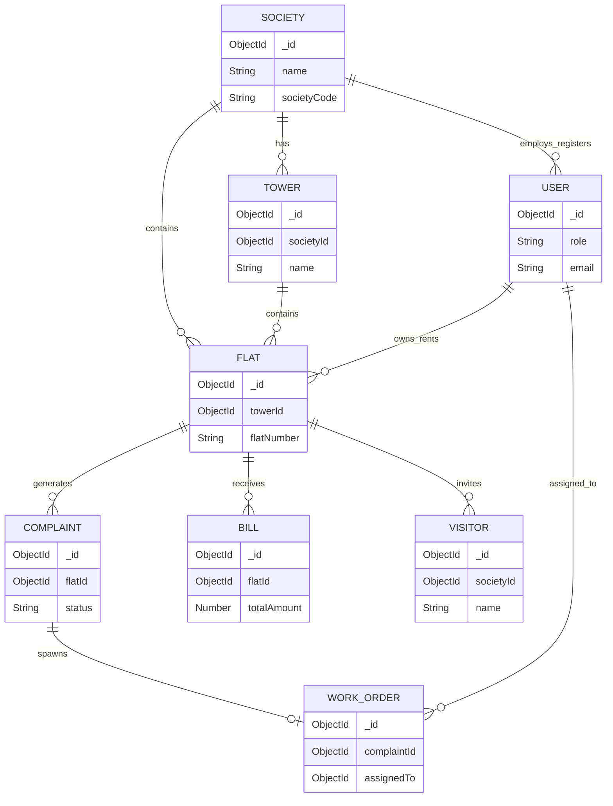

# Database Architecture

This document outlines the MongoDB schema design for the SocietySphere platform, including all collections, relationships, and validations.

*(Note: Multi-tenant isolation mechanisms via `societyId` are fully documented in `Security.md`.)*

## 1. Entity-Relationship (ER) Diagram

## 2. Core Principles

1. **Audit Trails**: Mongoose `timestamps: true` is enabled on all models, automatically providing `createdAt` and `updatedAt`. Some models include `createdBy` or `deletedBy`.
2. **Soft Deletes**: Deletions are typically handled via an `isArchived: true` flag and `archivedAt` timestamp (or `deletedAt`).
3. **Validation**: Enums are heavily used for statuses and types. Required fields and uniqueness constraints are enforced at the database level.

---

## 3. Model Overview

### 3.1 Society
- **Purpose**: Represents a registered housing society (tenant).
- **Fields**: `societyCode` (Unique), `name`, `address`, `city`, `state`, `pincode`, `setupProgress` (Object), `totalTowers`, `totalFlats`.
- **Enums**: `status` (DRAFT, SUBMITTED, UNDER_REVIEW, APPROVED, ACTIVE, REJECTED, SUSPENDED, ARCHIVED).

### 3.2 User
- **Purpose**: Stores all user accounts (Super Admin, Society Admin, Residents, Staff).
- **Fields**: `name`, `email` (Unique), `password`, `phone`, `accountStatus`, `canLogin`.
- **Enums**: `role` (super_admin, society_admin, resident, security, service_staff), `serviceCategory` (electrician, plumber, etc.).
- **Indexes**: `{ societyId: 1, role: 1, accountStatus: 1 }`.

### 3.3 Tower
- **Purpose**: Physical buildings within a society.
- **Fields**: `name`, `floorsCount`, `flatsPerFloor`, `isActive`.
- **Indexes**: Unique compound index `{ societyId: 1, name: 1 }`.

### 3.4 Flat
- **Purpose**: Individual apartments within a tower.
- **Fields**: `flatNumber`, `floor`, `wing`, `carpetArea`, `parkingSlots`, `maintenanceAmount`.
- **Enums**: `flatType` (1BHK, 2BHK, 3BHK, etc.), `occupancyType` (OWNER, TENANT, VACANT), `status` (VACANT, OCCUPIED).
- **Indexes**: Unique compound index `{ societyId: 1, towerId: 1, flatNumber: 1 }`.

### 3.5 Service Management (Complaints & Work Orders)
- **Complaint**: Tracks issues raised by residents (`priority`, `status`, `aiConfidence`).
- **WorkOrder**: The execution layer linking a Complaint to Service Staff.

### 3.6 Financials (Bill & Payment, Expense)
- **Bill**: Financial tracking for maintenance and other fees (`status`: PENDING, PAID, OVERDUE).
- **Expense**: Tracks society outgoing expenses.
- **Indexes**: Unique `{ societyId: 1, flatId: 1, billingCycle: 1 }`.

### 3.7 Visitor Management
- **Visitor**: Manages non-residents entering the premises (`visitorType`: GUEST, DELIVERY).
