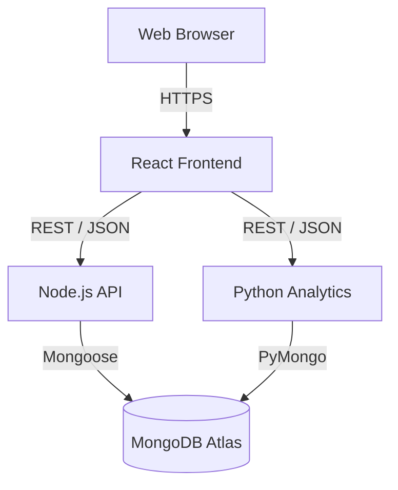

# Deployment & Startup Guide

This document explains how to start the complete SocietySphere ecosystem locally and notes for production deployment.

## 1. Deployment Architecture



## 2. Startup Order

Because services depend on each other, it is recommended to start them in this order:
1. **Database** (MongoDB)
2. **Python Analytics** (Requires MongoDB)
3. **Backend API** (Requires MongoDB, connects to Python API optionally)
4. **Frontend** (Requires Backend and Python API)

## 3. Running Locally (Development)

### 3.1 MongoDB
Ensure MongoDB is running locally on port 27017, or use a MongoDB Atlas URI in your `.env` files.

### 3.2 Python Analytics
```bash
cd python-analytics
# Windows: python -m venv .venv && .venv\Scripts\activate
# Mac/Linux: python3 -m venv .venv && source .venv/bin/activate
pip install -r requirements.txt
python main.py
```
*Runs on `http://localhost:8000`*

### 3.3 Backend (Node.js)
```bash
cd backend
npm install
npm run dev
```
*Runs on `http://localhost:5000`*

### 3.4 Frontend (React)
```bash
cd frontend
npm install
npm run dev
```
*Runs on `http://localhost:5173`*

---

## 4. Production Deployment Notes

### Frontend (React/Vite)
- Build the static assets: `npm run build`.
- Serve the `dist/` folder using a CDN, Nginx, Vercel, or Netlify.
- Ensure environment variables are set in the hosting provider.

### Backend (Node.js)
- Run `npm start` (points to `server.js`) rather than `npm run dev`.
- Use a process manager like **PM2** to keep the server alive and restart on crash.
- Setup a reverse proxy (Nginx) to route traffic to port `5000` and handle SSL/HTTPS.

### Python Analytics
- Do not use development servers (like Flask built-in) in production.
- Use a production WSGI/ASGI server like `gunicorn` or `uvicorn`.

### Database (MongoDB)
- Use MongoDB Atlas for a managed, scalable cloud database.
- Ensure IP access lists are configured to only allow connections from the Backend and Python production servers.
